# 🍰 SweetBite Bakery – UTS Pemrograman Web 1

**Nazwa Khoerunnisa**  

**23552011093**

**TIF RP 23 CNS A**

📌 Project 1 – Website SweetBite Bakery

SweetBite adalah website pemesanan produk bakery sederhana yang dibuat untuk memenuhi UTS Pemrograman Web 1.  
Website ini menampilkan halaman beranda, daftar produk, detail produk, promo, kontak, login, register, dan halaman pemesanan.

---

## 🧁 **Fitur Website**
- Halaman Home / Landing Page  
- Halaman Produk  
- Halaman Detail Produk  
- Halaman Promo  
- Halaman Pemesanan  
- Halaman Login & Register  
- Halaman Kontak  
- Navbar & Footer di setiap halaman  
- Responsive & clean UI

---

# 📸 **Screenshot Website**

### **SB1 – Halaman Home**

### **SB2 – Daftar Produk**

### **SB3 – Produk (Grid Tampilan 2)**
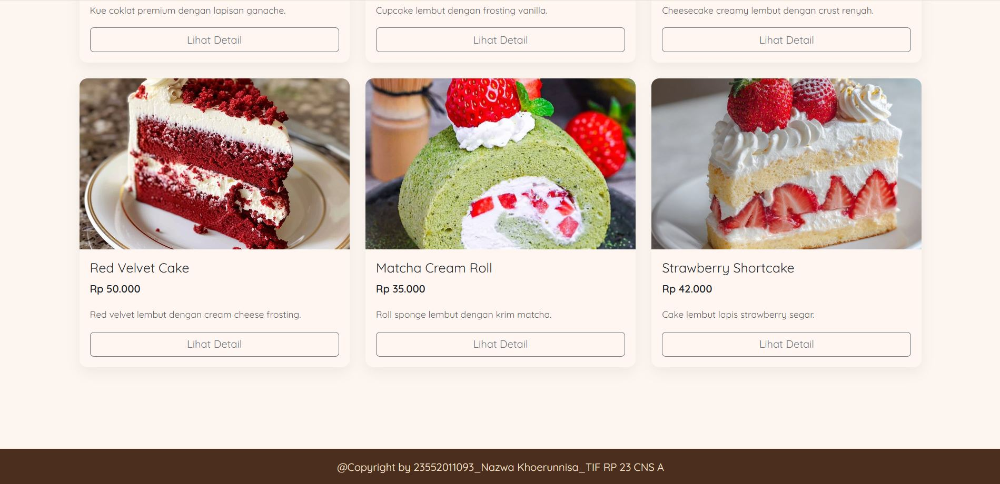

### **SB4 – Login**
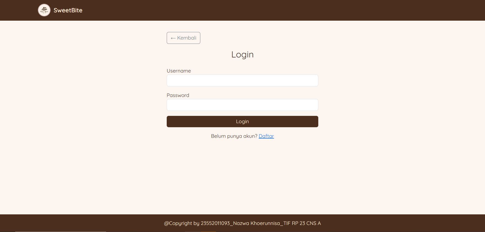

### **SB5 – Register**

### **SB6 – Navbar Menu**
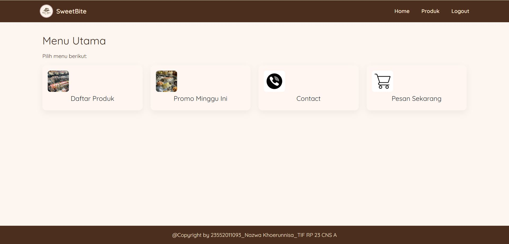

### **SB7 – Daftar Produk Lainnya**
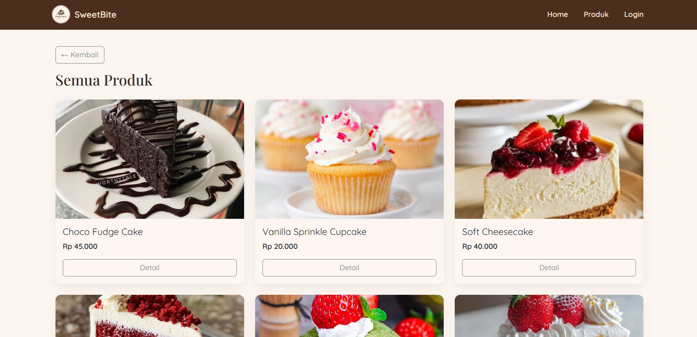

### **SB8 – Tampilan Produk**
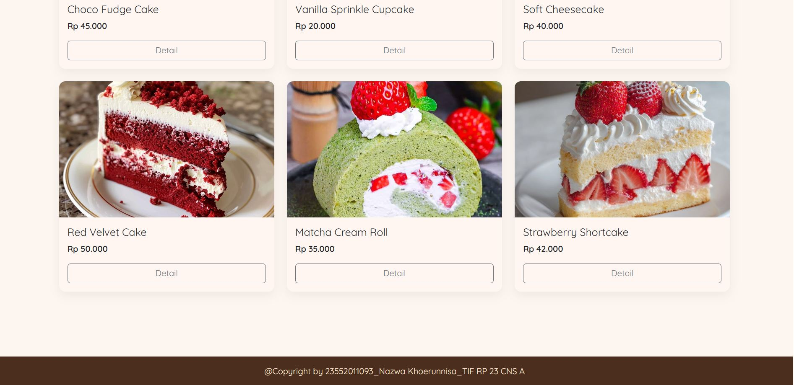

### **SB9 – Promo**
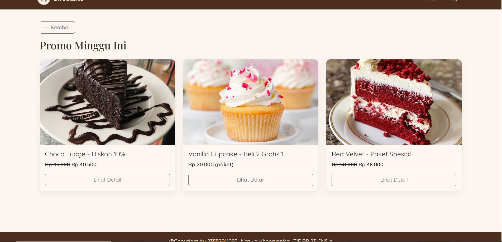

### **SB10 – Contact**
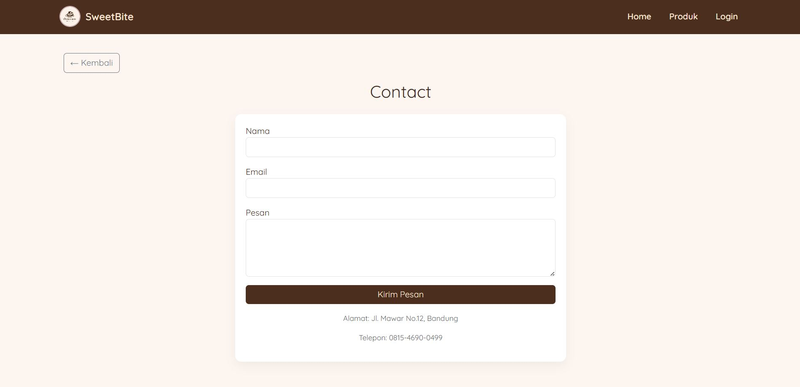

### **SB11 – Halaman Pesan**
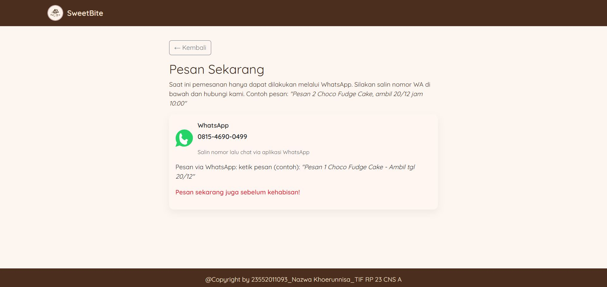

### **SB12 – Detail Produk**
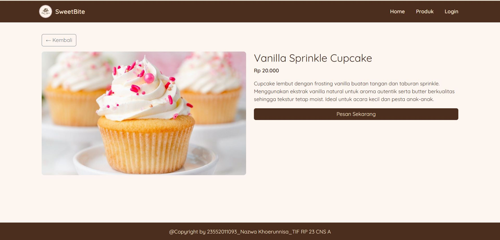

---

## 👨‍💻 **Teknologi yang Digunakan**
- HTML5  
- CSS3  
- JavaScript (jika digunakan)  
- Font Google  
- Responsive Layout

📌 Project 2 – CRUD REST API

API dibuat menggunakan PHP + MySQL, dan diuji menggunakan Bruno.

🔌 Database

Nama database:

uts_pw1_api

Tabel:

Field	Type
id	INT (Primary Key)
name	VARCHAR
price	INT
image	VARCHAR
⚙ Endpoint API
1️⃣ GET – Ambil semua produk

Method: GET
Endpoint:

/api/get_data.php

📷 Screenshot:

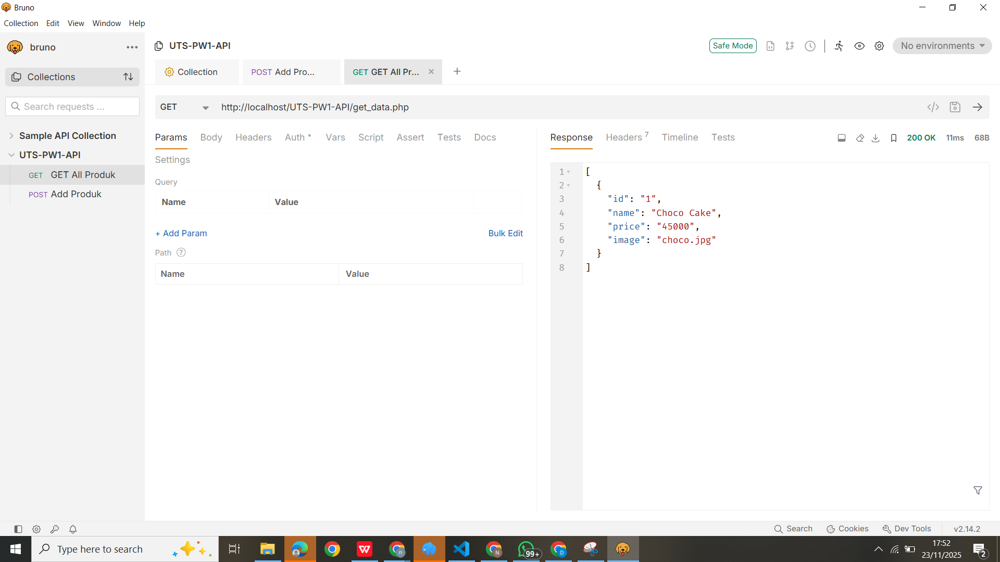

2️⃣ INSERT – Tambah produk

Method: POST
Endpoint:

/api/insup_data.php

JSON Body:

{
  "name": "Choco Cake",
  "price": 45000,
  "image": "choco.jpg"
}

📷 Screenshot:

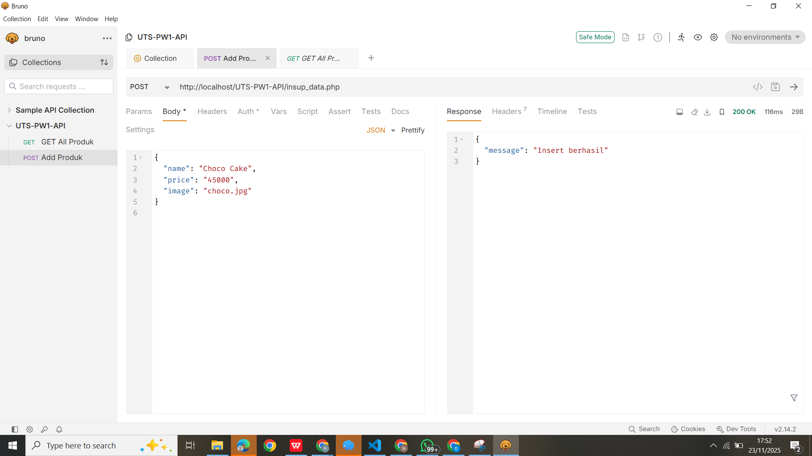

3️⃣ UPDATE – Update produk

Method: POST
Endpoint:

/api/insup_data.php

JSON Body:

{
  "id": 1,
  "name": "Choco Cake Premium",
  "price": 55000,
  "image": "choco_new.jpg"
}

📷 Screenshot:

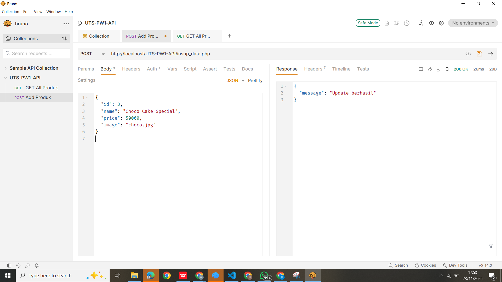

4️⃣ DELETE – Hapus produk

Method: POST
Endpoint:

/api/delete_data.php

JSON Body:

{
  "id": 1
}

📷 Screenshot:

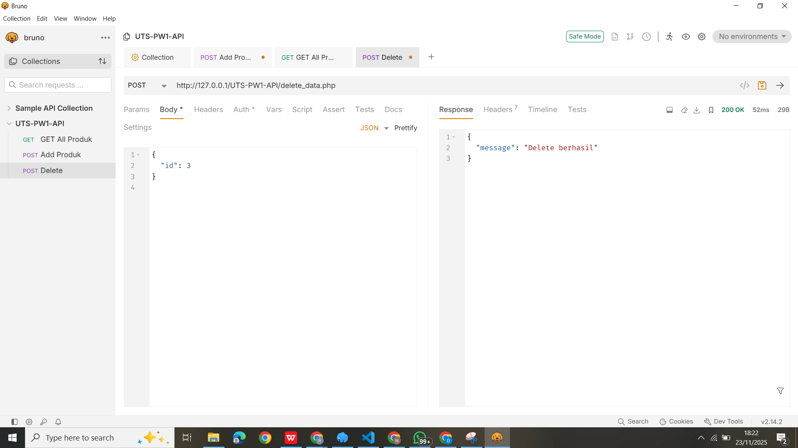

🛠 Tools yang Digunakan

Laragon (Apache + MySQL + PHP)

Bruno (API Testing)

Bootstrap 5

VS Code

Git & GitHub
